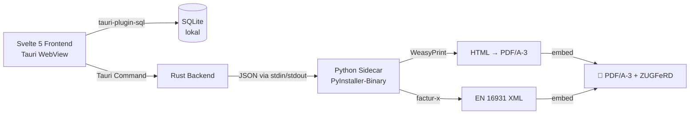

<div align="center">

# 🧾 Zettel

### Offline-first Rechnungen für deutsche Freelancer & Kleinunternehmer

**ZUGFeRD / Factur-X · PDF/A-3 · EN 16931 · lokal · open source**

[](https://github.com/jonax1337/zettel/releases)
[](./LICENSE)
[](https://github.com/jonax1337/zettel/actions/workflows/build.yml)
[](https://github.com/jonax1337/zettel/releases)
[](https://github.com/jonax1337/zettel/stargazers)

[](https://tauri.app)
[](https://svelte.dev)
[](https://www.typescriptlang.org)
[](https://tailwindcss.com)
[](https://python.org)
[](https://sqlite.org)

[**↓ Download**](https://github.com/jonax1337/zettel/releases) ·
[**📖 Plan**](./PLAN.md) ·
[**🤝 Contribute**](./CONTRIBUTING.md) ·
[**💬 Discussions**](https://github.com/jonax1337/zettel/discussions) ·
[**🐛 Issues**](https://github.com/jonax1337/zettel/issues)

<br />

<!-- TODO: Screenshot/GIF here -->
<sub>📸 *Screenshots & Demo-GIF folgen mit v0.1.0-Release*</sub>

</div>

---

## 💡 Warum Zettel?

| | SaaS-Tools (lexoffice, sevDesk, …) | **Zettel** |
|---|---|---|
| 💸 Kosten | 10 – 30 €/Monat | **0 €** |
| 🔒 Datenhoheit | Cloud, fremde Server | **lokal, SQLite** |
| 📴 Offline | ❌ | **✅ vollständig** |
| 📄 ZUGFeRD/Factur-X EN 16931 | ✅ | **✅** |
| 🧑‍💼 Kleinunternehmer-Modus | meist Aufpreis | **First-Class, kostenlos** |
| 🛠️ Open Source | ❌ | **✅ MIT** |
| 📦 Lock-in | hoch | **kein** |

> **Zielgruppe:** Solo-Selbstständige, Freelancer, Kleinunternehmer nach § 19 UStG, die ein lokales Tool wollen — keinen weiteren SaaS-Account.

---

## ✨ Features

<table>
<tr>
<td>

**📇 Stammdaten lokal**
- Kunden- & Rechnungsverwaltung in SQLite
- Konfigurierbare Nummernkreise (`K-0001`, `RE-{YYYY}-{NNNN}`)
- Logo-Upload für Rechnungen
- Customer-Snapshot pro Rechnung (rechtssicher)

</td>
<td>

**📄 E-Rechnung konform**
- PDF/A-3 mit eingebettetem Factur-X-XML
- ZUGFeRD-Profil **EN 16931** (BASIC/EXTENDED vorbereitet)
- Mehrere USt-Sätze pro Rechnung (0 %, 7 %, 19 %)
- 5/5 Test-Rechnungen gegen erechnungs-validator.de validiert ✅

</td>
</tr>
<tr>
<td>

**🧑‍💼 Kleinunternehmer-First**
- § 19 UStG als First-Class-Feature
- Automatischer Hinweistext
- BR-CO-26-konform (BT-29-Fallback bei fehlender USt-IdNr.)
- Korrekter `CategoryCode E` im XML

</td>
<td>

**💻 Cross-Platform**
- Windows (MSI + NSIS)
- macOS (Apple Silicon + Intel)
- Linux (.deb)
- Status-Workflow: Entwurf → Versandt → Bezahlt → Storniert

</td>
</tr>
</table>

---

## 🚀 Installation

### Download

Vorgefertigte Installer → **[Releases](https://github.com/jonax1337/zettel/releases)**

| Plattform | Format | Hinweis |
|---|---|---|
| 🪟 **Windows 10/11** | `.msi` / `.exe` (NSIS) | SmartScreen-Warnung beim ersten Start → „Weitere Informationen" → „Trotzdem ausführen" |
| 🍎 **macOS 13+** | `.dmg` (arm64 + x86_64) | Nicht notarisiert — Rechtsklick → „Öffnen" beim ersten Start |
| 🐧 **Linux** | `.deb` (Ubuntu 22.04+) | Pango/Cairo nötig (s. unten) |

### Linux/macOS – Systemdeps für WeasyPrint

```bash
# Ubuntu / Debian
sudo apt install libpango1.0-0 libcairo2 libgdk-pixbuf2.0-0

# macOS
brew install pango cairo gdk-pixbuf
```

---

## ⚡ Quickstart

```text
1. Einstellungen → Firmendaten & Steuernummer ausfüllen
2. Kunden → „Neuer Kunde"
3. Rechnungen → „Neue Rechnung" → Positionen → speichern
4. „PDF erzeugen"
   └─→ ~/Documents/Zettel/Rechnungen/RE-2026-0001.pdf
```

---

## 🧱 Architektur



<details>
<summary><b>📐 Tech-Stack im Detail</b></summary>

| Layer | Tech |
|---|---|
| **Desktop-Wrapper** | Tauri 2 (Rust + WebView) |
| **Frontend** | Svelte 5 (Runes), TypeScript strict, Vite, Tailwind v4 |
| **UI** | Bits-UI-Primitives + shadcn-Style-Wrapper unter `src/lib/ui/`, Lucide-Icons, Light/Dark/System-Theme |
| **Routing** | `svelte-spa-router` (hash-based, kein SvelteKit) |
| **Persistenz** | `tauri-plugin-sql` + SQLite (lokale Datei), Drizzle nur als Schema/Types |
| **Money** | immer **Cent als Integer** in DB — kein Float |
| **PDF / XML** | Python 3.12 Sidecar mit WeasyPrint, factur-x, Jinja2 |
| **Bundling** | PyInstaller (Sidecar) + Tauri Bundle (Installer) |
| **CI/CD** | GitHub Actions Matrix (Win / macOS-arm / macOS-x86 / Linux) |

</details>

---

## 🛠️ Entwicklung

```bash
# Dependencies
pnpm install

# Dev-Server (Tauri + Vite + Sidecar)
pnpm tauri:dev
```

<details>
<summary><b>Release-Build inkl. Sidecar-Bundle</b></summary>

```bash
# 1. Python-Sidecar bundlen
cd sidecar && python build.py && cd ..

# 2. Tauri-Release-Build
pnpm tauri:build
```

→ Installer landen in `src-tauri/target/release/bundle/`.

</details>

<details>
<summary><b>Repo-Struktur</b></summary>

```
zettel/
├── src/                 # Svelte-Frontend
│   ├── lib/ui/          # shadcn-Style-Wrapper über Bits UI
│   ├── lib/db/          # SQLite-Queries + Migrations
│   ├── lib/sidecar/     # Tauri-Command-Wrappers
│   └── routes/          # Dashboard, Kunden, Rechnungen, Settings
├── src-tauri/           # Rust-Backend
│   └── src/sidecar.rs   # Bridge zum Python-Sidecar
├── sidecar/             # Python-Quellcode
│   ├── invoice/         # pdf.py, zugferd.py, templates.py
│   ├── templates/       # Jinja2: invoice.html.j2, zugferd-en16931.xml.j2
│   └── build.py         # PyInstaller-Config
└── .github/workflows/   # Matrix-Build (Win/macOS/Linux)
```

Mehr Details: [`PLAN.md`](./PLAN.md) · [`CLAUDE.md`](./CLAUDE.md) · [`CONTRIBUTING.md`](./CONTRIBUTING.md)

</details>

---

## 🗺️ Roadmap

| Milestone | Status |
|---|---|
| **M1** — Grundgerüst (Tauri + Svelte + SQLite + Kunden-CRUD) | ✅ |
| **M2** — Rechnungen ohne PDF | ✅ |
| **M3** — Python-Sidecar + PDF-Generierung | ✅ |
| **M4** — ZUGFeRD/Factur-X EN 16931 + Kleinunternehmer | ✅ |
| **M5** — Cross-Platform-Builds + Polish | ✅ |
| **M6** — Public OSS-Release (`v0.1.0`) | 🟡 in Arbeit |
| **v0.2** — BASIC/EXTENDED-Profile, Reverse-Charge, DATEV-Export | 📋 geplant |
| **v0.3** — Eingangsrechnungen einlesen, Backup/Restore | 📋 geplant |

Vollständige Roadmap → [`PLAN.md`](./PLAN.md)

---

## ❌ Was Zettel **nicht** ist

- ❌ Vollständige Buchhaltung (EÜR, BWA, Bilanz)
- ❌ Banking / Kontoabgleich (HBCI, FinTS)
- ❌ Cloud-Sync oder Mehrbenutzer-/Mehrmandantenfähigkeit
- ❌ Mobile App
- ❌ Steuer- oder Rechtsberatung

→ Siehe [Non-Goals in PLAN.md](./PLAN.md#3-non-goals-explizit-ausgeschlossen)

---

## 🤝 Contributing

Beiträge willkommen! Bevor du einen Issue oder PR aufmachst:

- 💬 **Fragen / Ideen?** → [Discussions](https://github.com/jonax1337/zettel/discussions)
- 🐛 **Bug?** → [Issue mit Bug-Template](https://github.com/jonax1337/zettel/issues/new?template=bug_report.yml)
- 💡 **Feature?** → [Feature-Template](https://github.com/jonax1337/zettel/issues/new?template=feature_request.yml) (vorher Non-Goals checken!)
- 📜 **ZUGFeRD-Validierungsfehler?** → [ZUGFeRD-Template](https://github.com/jonax1337/zettel/issues/new?template=zugferd_validation.yml)

Setup-Anleitung → [`CONTRIBUTING.md`](./CONTRIBUTING.md) · Verhaltensregeln → [`CODE_OF_CONDUCT.md`](./CODE_OF_CONDUCT.md)

---

## ⚠️ Disclaimer

> **Zettel ist keine Rechts- oder Steuerberatung.**
>
> Die Software gibt **keinerlei Garantie** auf rechtliche Korrektheit, Vollständigkeit oder Konformität der erzeugten Rechnungen mit aktuell geltendem Steuer- oder Handelsrecht.
>
> **Nutzung auf eigene Verantwortung.** Lass die ersten erzeugten Rechnungen von deinem Steuerberater prüfen, bevor du sie an Kunden versendest.

---

## 📜 Lizenz

[**MIT**](./LICENSE) © Jonas Laux & Contributors

<div align="center">

<sub>Built with ❤️ in Deutschland · [laux.digital](https://laux.digital)</sub>

<br />

<a href="https://github.com/jonax1337/zettel/stargazers">⭐ Star auf GitHub</a> ·
<a href="https://github.com/jonax1337/zettel/discussions">💬 Diskutiere mit</a> ·
<a href="https://github.com/jonax1337/zettel/releases">📥 Lade runter</a>

</div>
